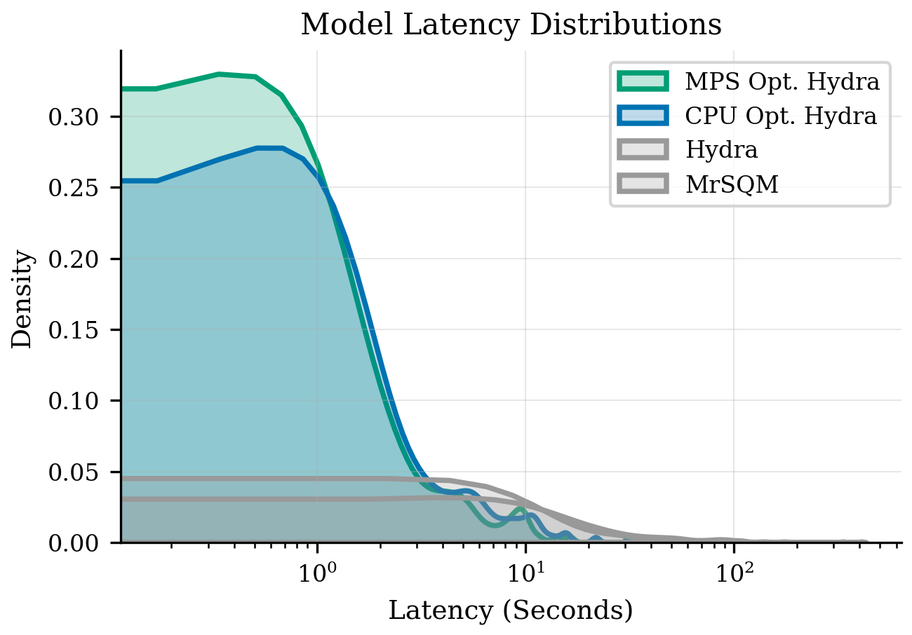

# Reproducing and Improving HYDRA for Time Series Classification

This repository contains the executable code, empirical evaluations, and proposed improvements for the HYDRA and MrSQM time series classification (TSC) models. As detailed in the accompanying report, this project reproduces the original models on the UCR 128 archive, addresses hardware-specific execution bugs on Apple Silicon (MPS), and introduces two major improvements to the HYDRA architecture:
1. **Dynamic Batching:** A sequence-length-aware batching strategy that significantly reduces latency.
2. **Explainability via Saliency Maps:** A novel method to extract temporal feature importance from HYDRA's Ridge Classifier, providing MrSQM-style explainability evaluated via targeted signal perturbation.

## Environment Setup

This project uses **Python 3.13+**. You can set up the environment using either `uv` (recommended) or standard `pip`. The primary dependencies are `torch`, `scikit-learn`, `numpy`, and `aeon` (for UCR dataset loading).

### Option 1: Using `uv` (Recommended)
If you have [uv](https://github.com/astral-sh/uv) installed, the project includes a `pyproject.toml` file. Simply run:
```bash
uv sync
```

### Option 2: Using standard `pip`
If you prefer standard Python tools, a `requirements.txt` file is provided. Set up your virtual environment as usual:
```bash
pip install -r requirements.txt
```

## Project Structure

* `experiments/`
  * `pipeline.py` - Handles the empirical evaluations of the baseline models and HYDRA and MrSQM variants.
* `experiments/`
  * `utils.py` - Helper scripts for dataset loading (`load_dataset`) and device management (`get_torch_device`).
* `./`
  * `hydra_coffee_example.ipynb` - An interactive notebook illustrating the updated HYDRA model and Saliency Map generation on the Coffee dataset.
  * `pyproject.toml` / `requirements.txt` - Dependency management files.

## How to Run

To test the updated model and reproduce the results:
1. Complete the environment setup above.
2. Open `./hydra_coffee_example.ipynb` in your Jupyter environment.
3. Run all cells sequentially to observe the execution of the hardware-optimised HYDRA model and view the resulting accuracy and execution time.

---

## Performance Improvements

### Latency Optimisation (Dynamic Batching)
By dynamically adjusting batch sizes based on sequence lengths (targeting 4,000 elements for MPS and 5,000 for CPU), we eliminated massive bottlenecks on exceptionally long datasets.

**Latency Statistics across 128 UCR Datasets:**

| Model | Mean (s) | Std (s) | Min (s) | Median (s) | Max (s) |
| :--- | :--- | :--- | :--- | :--- | :--- |
| **MrSQM (Original)** | 22.16 | 41.33 | 0.16 | 5.97 | 333.81 |
| **HYDRA (Original)** | 9.05 | 36.82 | 0.04 | 1.65 | 409.91 |
| **HYDRA (CPU Opt)** | 2.84 | 4.62 | **0.03** | 0.87 | 31.42 |
| **HYDRA (MPS Opt)** | **2.18** | 4.03 | 0.05 | **0.57** | **31.22** |

*(Accuracy remained completely preserved at ~84.8% across all HYDRA variants).*


*Figure 1: Log-scaled comparison of latency distributions across models, illustrating the extreme variance reduction achieved by dynamic batching.*

### Explainability (Saliency Mapping)
To overcome HYDRA's "black-box" nature, we introduced a method mapping 1,024-dimensional feature coefficients back to original time steps, highlighting highly discriminative regions.


*Figure 2: Qualitative comparison of HYDRA and MrSQM saliency maps. Highly salient (hot) regions denote areas most responsible for the model's classification decision.*